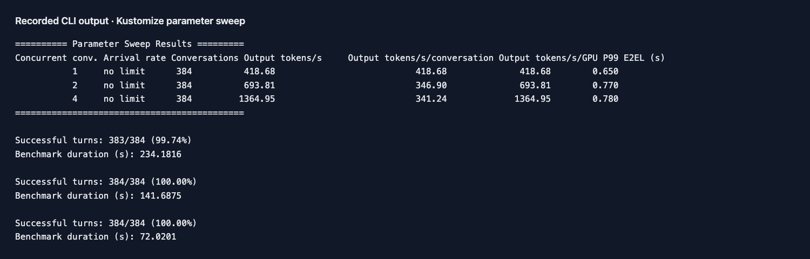
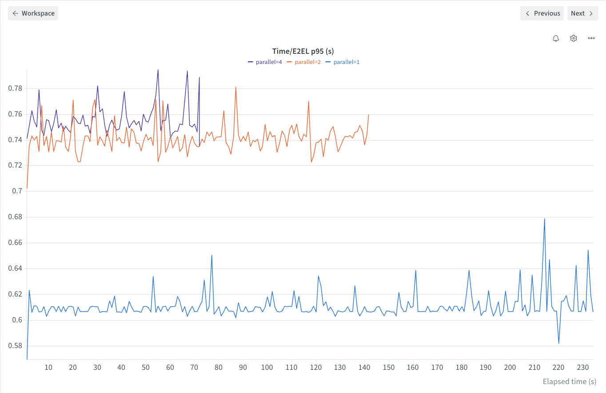
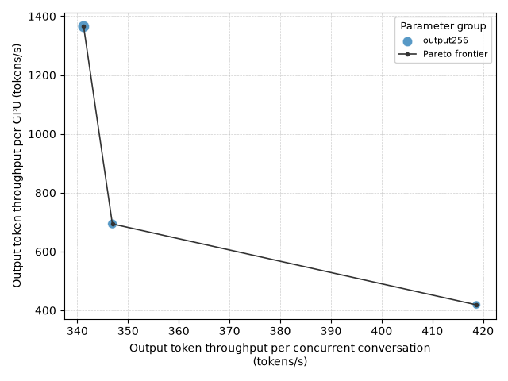

# 参数扫描

[English](sweep.md) | 简体中文 · [常用命令](../examples_zh.md)

完成[准备步骤](../examples_zh.md#准备)后，先部署服务并预热，再比较不同并发：

```bash
foretoken deploy examples/quickstart --timeout 20m
for parallel in 1 2 4; do
  foretoken bench examples/quickstart \
    --dataset random --tokenizer-path Qwen/Qwen3-0.6B \
    --min-prompt-length 128 --max-prompt-length 256 --random-seed 0 \
    --min-output-length 256 --max-output-length 256 \
    --parallel "$parallel" --number 16 --output local
done
```

使用相同输入运行扫描。参数文件比较并发 1、2、4，每组 384 个请求，每个请求输出 256 token：

```bash
foretoken bench examples/quickstart \
  --dataset random --tokenizer-path Qwen/Qwen3-0.6B \
  --min-prompt-length 128 --max-prompt-length 256 --random-seed 0 \
  --sweep benchmarks/examples/sweep.jsonl \
  --experiment-name quickstart-sweep \
  --output local,wandb
```

[参数文件](../../examples/sweep.jsonl)采用 JSONL 格式。`parallel`、`number` 或 `rate` 的列表会展开成负载点。同一行只能将 `parallel` 或 `rate` 中的一个设为多值列表；`number` 也是多值列表时，长度需与该轴一致。

每行可以改变负载、生成或数据集设置，包括输出长度上下界。服务身份、凭据、轨迹来源和结果去向保持不变。扫描不与轨迹回放或多数据集组合。`--num-runs` 可重复运行各参数点。

每个参数点都有结果目录。`sweep_points.json` 保存全部结果；有效点足够时，`pareto/PARETO.png` 比较每个配置用户与每张 GPU 的输出 token 吞吐量。再次实验时选择新的 `--experiment-name`，或省略它使用自动创建的目录。

使用完后，执行 `foretoken delete examples/quickstart` 删除服务。

## 输出示例

以下结果来自单张 A100 80GB PCIe 上的 Qwen3-0.6B。并发 1 的运行保留了一条失败请求（383/384 成功），其余两组均为 384/384 成功。



W&B 曲线展示每个一秒窗口内完成请求的 E2EL p95；整组吞吐量使用汇总结果和帕累托图比较。




